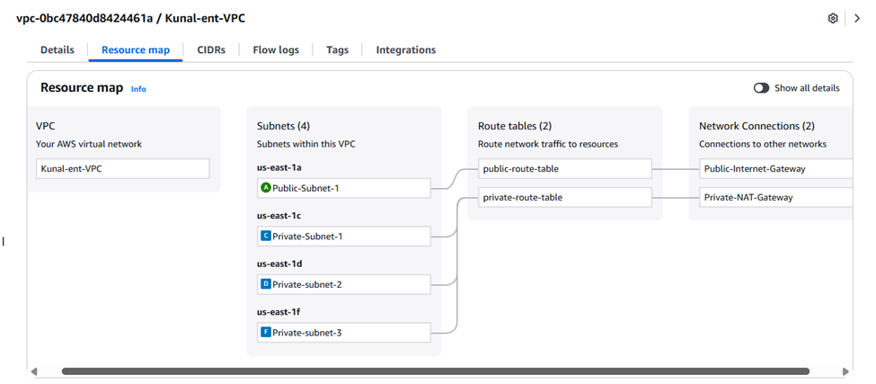
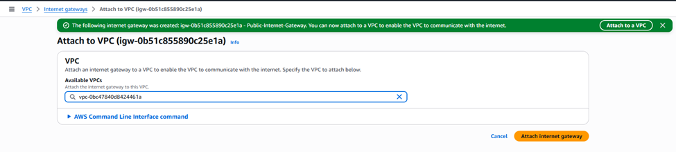

# AWS VPC Setup with Bastion, MySQL, Nginx, and Git Servers

This project demonstrates how to create a custom **VPC setup** in AWS from scratch, including public and private subnets, an Internet Gateway, a NAT Gateway, and Route Tables.  
It also covers how to launch and connect to multiple servers — **Bastion (Jump Server), MySQL, Nginx, and Git** — configured within different subnets to ensure security and controlled access.

---

##  Prerequisites
- AWS account with EC2 and VPC permissions.
- Key pair (`.pem` file) for SSH (Keep same over all instances).
- Basic understanding of IP ranges, CIDR, and routing.

---

---

##  Architecture Overview

This setup ensures secure network isolation:

* **Public Subnet:** Only Bastion Host has internet access.
* **Private Subnets:** MySQL, Nginx, and Git servers communicate via the NAT Gateway.
* **Routing:** All outbound private traffic flows through the NAT Gateway; inbound access is restricted.


---

##  Steps

### 1. Create a VPC
- Open the **VPC service** in AWS Console.
- Click **Create VPC**.
- Provide a **VPC Name** and **CIDR Block** (e.g., `10.0.0.0/16`).


---

### 2. Create Subnets
- In the **VPC Dashboard**, go to **Subnets**.

- Click **Create Subnet** and select your VPC.

- Add a **Public Subnet** (for Bastion Host).

- Similarly, create **3 Private Subnets** for:
  - MySQL
  - Nginx
  - Git server



 *Tip:* Ensure you plan CIDR ranges properly before adding subnets.


---

### 3. Create and Attach an Internet Gateway (IGW)
- Go to **Internet Gateways → Create Internet Gateway**.
- Name it (e.g., `MyVPC-IGW`).
 
- Attach the IGW to your VPC.



---

### 4. Configure Route Tables
- Go to **Route Tables** and select the one associated with your VPC.
- Rename it (e.g., `Public-RT`).
- Click **Actions → Edit routes → Add route**.

- Add destination `0.0.0.0/0` and select your IGW as the target.


---

### 5. Create NAT Gateway
- Go to **NAT Gateways → Create NAT Gateway**.
- Select **Public Subnet** and **Elastic IP**.

- After creation, note its ID.


---

### 6. Create Route Table for NAT Gateway
- Create a new **Route Table** (e.g., `Private-RT`).

- Edit its routes:

  - Destination: `0.0.0.0/0`
  - Target: **NAT Gateway**
- Edit **Subnet Associations** → Associate with all **Private Subnets**.


---

### 7. Launch Instances
Launch the following instances within the same VPC:

| Instance Type | Subnet Type | Purpose |
|----------------|-------------|----------|
| **Bastion Server** | Public | To connect to private servers securely |
| **MySQL Server** | Private Subnet-1 | Database Server |
| **Nginx Server** | Private Subnet-2 | Web Server |
| **Git Server** | Private Subnet-3 | Version Control Server |


---

##  Connecting to Private Instances

### Step 1: Connect to Bastion Server
Use **EC2 Instance Connect** or SSH to connect to the Bastion host.

### Step 2: Transfer Private Key
Copy your private key from local system to Bastion server:

```bash
scp -i "your-key.pem" your-key.pem ec2-user@<Bastion-Public-IP>:/home/ec2-user/
````

Give proper permissions:

```bash
chmod 400 your-key.pem
```
---

### Step 3: Connect to MySQL Server via Bastion

```bash
ssh -i "your-key.pem" ec2-user@<MySQL-Private-IP>
```

Change hostname and install MySQL:

```bash
sudo hostnamectl set-hostname mysql

sudo yum install mariadb105-server -y
mysql --version
```


---

### Step 4: Connect to Nginx Server via Bastion

```bash
ssh -i "your-key.pem" ec2-user@<Nginx-Private-IP>
```

Change hostname and install Nginx:

```bash
sudo hostnamectl set-hostname nginx
sudo yum install nginx -y
nginx -v
```


---

### Step 5: Connect to Git Server via Bastion

```bash
ssh -i "your-key.pem" ec2-user@<Git-Private-IP>
```

Change hostname and install Git:

```bash
sudo hostnamectl set-hostname git
sudo yum install git -y
```

```bash
git --version
```


##  Repository Information

* **Repo Name:** `aws-vpc-bastion-private-servers`
* **Description:** Demonstrates creation of a secure AWS VPC with Bastion, NAT Gateway, and private servers (MySQL, Nginx, Git) following best security practices.

---

##  Contact

If you have questions or face any issues, feel free to reach out:

* Email: **[kunalshinde043@gmail.com](mailto:kunalshinde066@gmail.com)**
* LinkedIn: [Kunal Shinde](https://www.linkedin.com/in/kunal-shinde-1b17a2205/)

---

